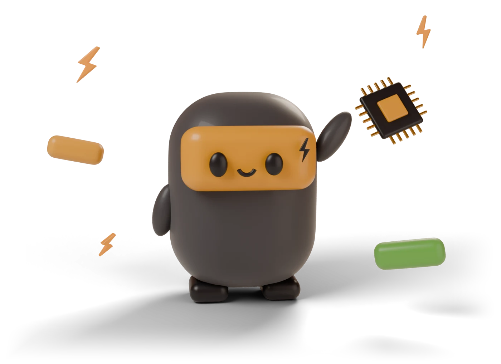
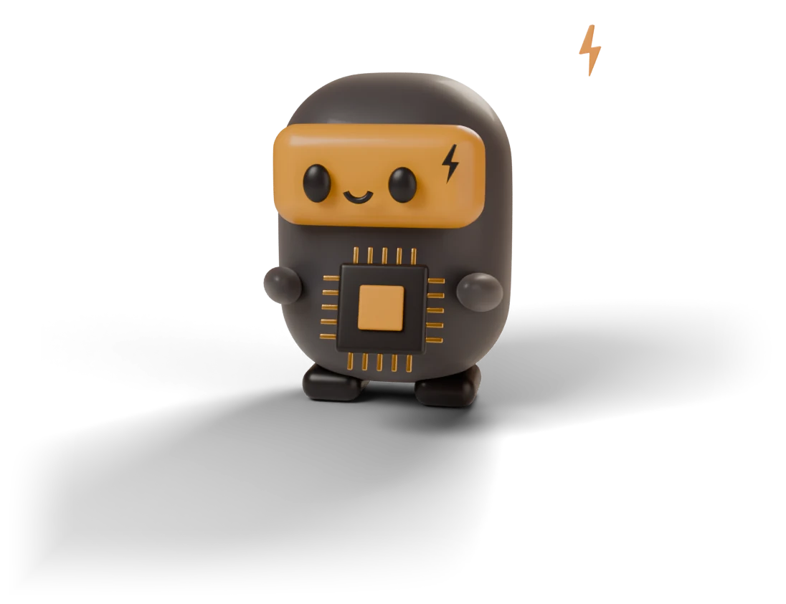
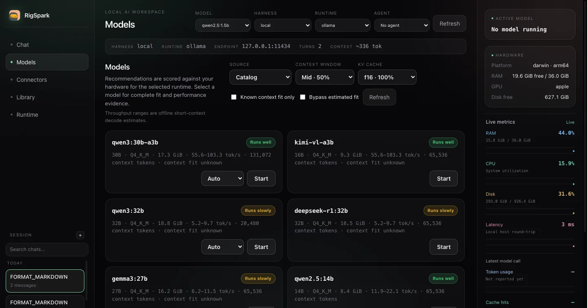

<h1 align="center">
  RigSpark
</h1>

<p align="center">
  
</p>

<h2 align="center">Know what your computer can run before you download it.</h2>

<p align="center">
  RigSpark is a hardware-aware native Rust CLI that gives local AI models a
  <strong>yes / slow / no</strong> verdict, explains the fit, and estimates
  tokens per second before you commit to the weights.
</p>

<p align="center">
  <a href="https://shashankswe2020-ux.github.io/rigspark/">Website</a> ·
  <a href="#install-rigspark">Install</a> ·
  <a href="docs/references/guide.md">Guide</a> ·
  <a href="https://github.com/shashankswe2020-ux/rigspark/releases/latest">Latest release</a>
</p>

<p align="center">
  <a href="https://github.com/shashankswe2020-ux/rigspark/actions/workflows/ci.yml"></a>
  <a href="https://github.com/shashankswe2020-ux/rigspark/releases/latest"></a>
  <a href="https://crates.io/crates/rigspark-cli"></a>
  <a href="https://docs.rs/rigspark-core"></a>
  <a href="rust-toolchain.toml"></a>
  <a href="LICENSE"></a>
</p>

---

## Let Sparky check your rig

RigSpark keeps the first question simple: **will this model actually run here?**
The answer comes from a curated offline catalog and your detected hardware, not
from a download you have already waited for.

### 1. Install RigSpark

<p align="center">
  
</p>

Homebrew on macOS or Linux:

```bash
brew install shashankswe2020-ux/tap/rigspark
```

On Windows and other platforms, download a
[prebuilt archive](https://github.com/shashankswe2020-ux/rigspark/releases/latest),
extract it, and add the folder to `PATH`. Keep `rigspark`, `llmup`, and
`rigspark-gui` together.

The RigSpark binaries need no Node.js, Python, or compiler. Inference backends
have their own requirements.

[Cargo, checksums, unsigned macOS archives, upgrades, and Docker caveats →](docs/references/guide.md#install)

### 2. Sparky sizes up your hardware

<p align="center">
  
</p>

Start with advice. It is deterministic, works offline, and does not require an
inference backend:

```bash
rigspark recommend
rigspark can-run llama3.1:8b
rigspark catalog --all
```

- `recommend` ranks the catalog for this machine.
- `can-run` checks one model before you download it.
- `catalog --all` lets you browse the bundled model data.

Use `--json` for automation and `--accessible` for screen-reader-friendly
output. `llmup` remains a compatibility alias.

### 3. Read the face: yes, slow, or no

<p align="center">
  
</p>

| Verdict | What Sparky means |
| --- | --- |
| **yes** | The model fits with the required headroom. |
| **slow** | It fits, but the expected experience may be constrained. |
| **no** | It does not safely fit the detected memory budget. |

Every verdict includes the reason. When RigSpark cannot source a figure, it says
`unknown` rather than inventing one. Throughput ranges are estimates, not
benchmarks.

### 4. Pick a model, verify it, and start

Once you have a fit, move from advice to a running model:

```bash
rigspark up llama3.1:8b    # pull, verify, and serve
rigspark chat              # chat with the active model
rigspark ls                # inspect managed models
rigspark switch            # change the active model
rigspark down              # stop when done
```

RigSpark supports:

- **Ollama** — recommended default and managed child process
- **llama.cpp** — native local serving
- **MLX** — Apple Silicon
- **LM Studio** — attach to an already running server

Managed weights pass an integrity check before serving. Servers bind to
`127.0.0.1` by default.

[Backend setup and lifecycle details →](docs/references/guide.md#supported-backends)

### 5. Continue in the browser workspace

```bash
rigspark gui
```

Choose a model, inspect the same hardware verdicts, chat, and use agents, skills,
and MCP tools from the loopback-only browser workspace.

<p align="center">
  
</p>

Local chat stays on your machine. Cloud harnesses and external tools can send
data to their own providers, so RigSpark keeps those boundaries visible.

[Browser workspace, agents, and tools →](docs/references/guide.md#browser-gui)

### 6. Let Sparky create images and short videos

<p align="center">
  
</p>

RigSpark can orchestrate open-weight image and video models through your own
[ComfyUI](https://github.com/Comfy-Org/ComfyUI) installation.

```bash
rigspark catalog --generation
rigspark generate image --prompt "a lighthouse at dusk" --comfyui-dir ~/ComfyUI
rigspark generate video --prompt "a fox running in snow" --comfyui-dir ~/ComfyUI
rigspark generate --tui
```

Start ComfyUI on its default loopback address, `127.0.0.1:8188`. RigSpark
downloads pinned weights, verifies their SHA-256 digest, installs only its
built-in local workflows, and refuses paid Partner API nodes. Generation speed
stays `unknown` when no defensible measurement is available.

In `rigspark gui`, switch the composer from **Text** to **Image** or **Video**.
Generated media renders inline and is never sent to the language model.

<p align="center">
  
</p>

[Image and video generation specification →](docs/specs/image-video-generation.md)

---

## Why the answers are trustworthy

<p align="center">
  
</p>

- **Offline advice.** Recommendation commands use a bundled, curated catalog and
  make no network calls.
- **Honest unknowns.** Missing bandwidth, model geometry, or measurements stay
  visibly `unknown`.
- **Fail-closed integrity.** Managed weights must match their catalog digest, or
  a documented size-floor fallback, before RigSpark serves them.
- **Loopback by default.** Local servers listen on `127.0.0.1`, not the public
  network.
- **Reproducible decisions.** The same hardware and catalog produce the same
  recommendation.
- **One adapter boundary.** Ollama, llama.cpp, MLX, and LM Studio sit behind the
  same runtime lifecycle and safety gates.

## Update the catalog when you choose

Normal recommendations and startup remain offline. A catalog update is always
explicit:

```bash
rigspark catalog --status
rigspark catalog --update
```

RigSpark verifies the signed catalog before activating it atomically. An invalid
signature, incompatible schema, or network failure leaves the current snapshot
unchanged. Recovery falls back through the previous verified snapshot and then
the bundled catalog, with visible warnings.

`rigspark catalog --refresh` is a maintainer preview of enrichment against the
bundled registry snapshot; it does not install a published catalog.

[Catalog provenance, trust, and recovery →](docs/references/guide.md#independent-catalog-updates)

## A 20-second tour

[](assets/rigspark.mp4)

The tour runs `rigspark recommend`, shows models that do and do not fit, then
opens the same verdicts and a local chat in `rigspark gui`.

[Watch in 1080p with sound](assets/rigspark.mp4) ·
[Earlier demo on YouTube](https://youtu.be/MI2wfI1eeCM?si=QA2teeDmeT_fNIqf)

## Find your next command

| Goal | Command |
| --- | --- |
| Rank models for this machine | `rigspark recommend` |
| Check one model | `rigspark can-run <model>` |
| Diagnose hardware and runtimes | `rigspark doctor` |
| Browse text models | `rigspark catalog --all` |
| Browse image and video models | `rigspark catalog --generation` |
| Start a verified model | `rigspark up <model>` |
| Open the terminal UI | `rigspark` |
| Open the browser workspace | `rigspark gui` |
| Generate local media | `rigspark generate` |
| Stop the active model | `rigspark down` |

Run `rigspark --help` for the complete CLI.

## Project map

- [`crates/rigspark-core/`](crates/rigspark-core/) — catalog, memory sizing,
  ranking, advice, and reports
- [`crates/rigspark-runtime/`](crates/rigspark-runtime/) — hardware detection,
  backend adapters, lifecycle, state, and harnesses
- [`crates/rigspark-gui/`](crates/rigspark-gui/) — loopback HTTP/SSE host and
  embedded browser client
- [`crates/rigspark-cli/`](crates/rigspark-cli/) — native CLI, terminal UI, and
  catalog maintenance
- [`apps/desktop/src-tauri/`](apps/desktop/src-tauri/) — native desktop shell

## Build from source

RigSpark is a Rust workspace pinned to Rust 1.98.1:

```bash
cargo build --workspace --locked
cargo test --workspace --locked -- --test-threads=2
cargo clippy --workspace --all-targets --locked -- -D warnings
cargo fmt --all -- --check
cargo native-retirement
```

No Node.js or TypeScript tooling is part of the project.

## Keep exploring

- [Commands, custom context, and installed models](docs/references/guide.md#commands)
- [Terminal UI](docs/references/guide.md#terminal-ui)
- [How hardware advice works](docs/references/guide.md#how-advice-works)
- [Scripting and exit codes](docs/references/guide.md#scripting--exit-codes)
- [FAQ](docs/references/guide.md#faq) and [troubleshooting](docs/references/guide.md#troubleshooting)
- [Development guide](docs/references/guide.md#development)
- [Project specification](docs/specs/rigspark.md)
- [Changelog](CHANGELOG.md)

<p align="center">
  
</p>

<p align="center">
  <strong>Let Sparky check your rig.</strong><br>
  <a href="https://github.com/shashankswe2020-ux/rigspark/releases/latest">Download RigSpark</a> ·
  <a href="https://github.com/shashankswe2020-ux/rigspark">Star on GitHub</a>
</p>

---

[MIT License](LICENSE)

**Keywords:** local LLM, run LLM locally, LLM hardware requirements, VRAM
calculator, tokens per second, Ollama, llama.cpp, MLX, LM Studio, Rust CLI.
