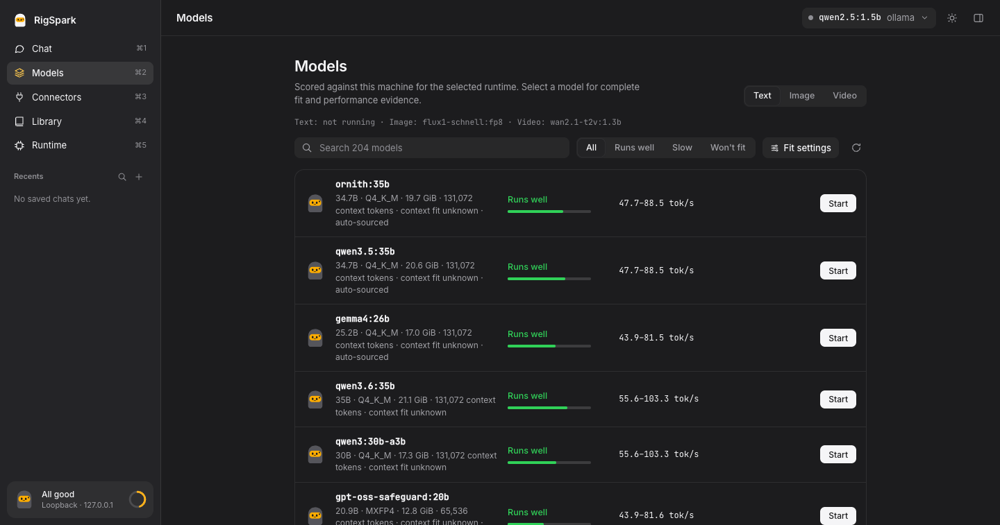

#  RigSpark: Check Which Local LLMs Your Computer Can Run

[](https://github.com/shashankswe2020-ux/rigspark/actions/workflows/ci.yml)
[](https://github.com/shashankswe2020-ux/rigspark/releases/latest)
[](https://crates.io/crates/rigspark-cli)
[](https://crates.io/crates/rigspark-cli)
[](https://docs.rs/rigspark-core)
[](rust-toolchain.toml)
[](https://github.com/shashankswe2020-ux/rigspark/releases/latest)
[](https://shashankswe2020-ux.github.io/rigspark/)
[](LICENSE)

**Which local LLMs can your computer run? Find out before downloading the weights.**

RigSpark scores your hardware and gives every model a `yes / slow / no` verdict,
a memory-fit explanation, and an estimated tok/s range. Then it verifies, serves,
and chats with the model you pick. It is an open-source, privacy-first Rust CLI
with a terminal UI and a browser workspace for macOS, Linux, and Windows.

[](assets/rigspark.mp4)

*20-second tour:* `rigspark recommend` ranks the offline catalog on an arm64 Mac with
34 GiB of usable RAM and lists the models that won't fit; `rigspark gui` then shows
the same verdicts and a local chat.
[Watch in 1080p with sound](assets/rigspark.mp4) · [Earlier demo on YouTube](https://youtu.be/MI2wfI1eeCM?si=QA2teeDmeT_fNIqf)

## Why RigSpark

- **Know before you download.** Estimates RAM and GPU/VRAM fit for models such as
  Llama, Qwen, Mistral, and Gemma.
- **Honest numbers.** Advice uses a bundled offline catalog. Unknown figures stay
  `unknown`; estimates are not benchmarks.
- **Safe by default.** Managed downloads are integrity-checked, and servers bind
  to `127.0.0.1`.
- **Bring your backend.** Works with **Ollama**, **llama.cpp**, **MLX** (Apple
  Silicon), and **LM Studio** (attach-only).

## Install

Homebrew (macOS and Linux):

```bash
brew install shashankswe2020-ux/tap/rigspark
```

Windows and other platforms: download a
[prebuilt archive](https://github.com/shashankswe2020-ux/rigspark/releases/latest),
extract it, and add the folder to `PATH`. Keep `rigspark`, `llmup`, and
`rigspark-gui` together. The binaries need no Node.js, Python, or compiler;
inference backends have their own requirements.

More: [Cargo, checksums, unsigned macOS archives, and upgrades](docs/references/guide.md#install)
· [Docker caveats](docs/references/guide.md#docker)

## Quick Start

```bash
rigspark recommend              # rank models for your hardware
rigspark can-run llama3.1:8b    # check one model before downloading
rigspark catalog --all          # browse the offline catalog
rigspark up llama3.1:8b         # pull, verify, and serve
rigspark chat                   # chat with the active model
rigspark down                   # stop when done
```

Advice works without a backend. To serve and chat, install
[Ollama](https://ollama.com) or another [supported backend](docs/references/guide.md#supported-backends).
Use `rigspark --help` for all commands, `--json` for scripting, and
`--accessible` for screen readers. `llmup` remains a compatibility alias.

## Catalog Updates

RigSpark can activate a signed model catalog independently of an application
release. Updating is always explicit; recommendations and normal startup remain
offline.

[Watch the catalog update flow](assets/catalog-update.mp4)

```bash
rigspark catalog --status  # show the active source, revision, digest, and model count offline
rigspark catalog --update  # download, verify, and atomically activate the official catalog
```

The Models view exposes the same provenance and an **Update catalog** action.
Invalid signatures, incompatible catalogs, and network failures leave the current
snapshot unchanged. RigSpark can recover through the previous verified snapshot
and then its bundled catalog, with visible warnings.

`rigspark catalog --refresh` is different: it previews maintainer enrichment from
the bundled registry snapshot and does not install a published catalog. New model
admission still requires reviewed evidence; a newer catalog date is not a promise
of complete upstream coverage. See [catalog behavior, trust, and launch
availability](docs/references/guide.md#independent-catalog-updates).

## Image and Video Generation

RigSpark can also run open-weight image and video models locally and for free
through your own [ComfyUI](https://github.com/Comfy-Org/ComfyUI) install. Start
ComfyUI on its default loopback address (`127.0.0.1:8188`), then:

```bash
rigspark catalog --generation                               # image/video models + memory fit
rigspark generate image --prompt "a lighthouse at dusk" --comfyui-dir ~/ComfyUI
rigspark generate video --prompt "a fox running in snow" --comfyui-dir ~/ComfyUI
rigspark generate --tui                                      # interactive terminal form
rigspark gui                                                 # browser: Create view, or chat with the Image/Video toggle
```

| Model | Kind | License | Weights |
| --- | --- | --- | --- |
| `flux1-schnell:fp8` | image (PNG) | Apache-2.0 | 16.1 GiB |
| `wan2.1-t2v:1.3b` | video (animated WebP) | Apache-2.0 | 9.2 GiB |

Weights are pinned to a Hugging Face commit, checked against their SHA-256 on every
run, and placed under `ComfyUI/models/<folder>/rigspark/`. RigSpark submits only its
own built-in workflows, which use core local nodes. It refuses ComfyUI's paid
Partner (API) nodes, never sends account keys, and only connects over loopback.
The fit verdict covers weight memory only. Generation speed is reported as
`unknown`. Outputs are never overwritten. `--comfyui-dir` defaults to
`RIGSPARK_COMFYUI_DIR`, then `~/ComfyUI`. Interrupted downloads resume and are still
fully hash-verified. Details: [spec](docs/specs/image-video-generation.md).

## Browser Workspace

Run **`rigspark gui`** to pick a model that fits and chat with it, with agents,
skills, and MCP tools. Local chat stays on your machine; cloud harnesses and
external tools can send data to their providers.



## Star History

[](https://www.star-history.com/#shashankswe2020-ux/rigspark&Date)

## References

- [Commands, installed Ollama models, and custom context](docs/references/guide.md#commands)
- [Terminal UI](docs/references/guide.md#terminal-ui) · [Browser workspace, agents, and tools](docs/references/guide.md#browser-gui)
- [Catalog and maintenance](docs/references/guide.md#model-catalog) · [How advice works](docs/references/guide.md#how-advice-works)
- [Scripting and exit codes](docs/references/guide.md#scripting--exit-codes) · [Performance measurements](docs/references/guide.md#performance-10-native-vs-0114-node)
- [FAQ](docs/references/guide.md#faq) · [Troubleshooting](docs/references/guide.md#troubleshooting) · [Tool comparisons](docs/references/guide.md#rigspark-vs-ollama)
- [Development and testing](docs/references/guide.md#development) · [Specification](docs/specs/rigspark.md) · [Changelog](CHANGELOG.md)

[MIT License](LICENSE)

**Keywords:** local LLM, run LLM locally, LLM hardware requirements, VRAM calculator, tokens per second, Ollama, llama.cpp, MLX, LM Studio, Rust CLI.
